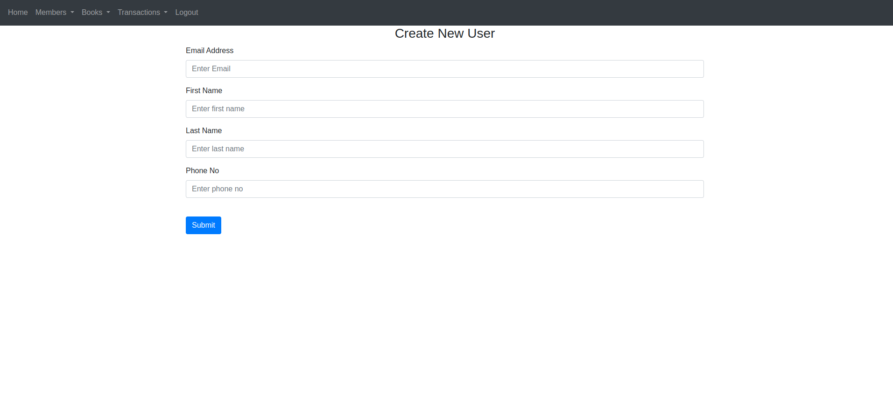
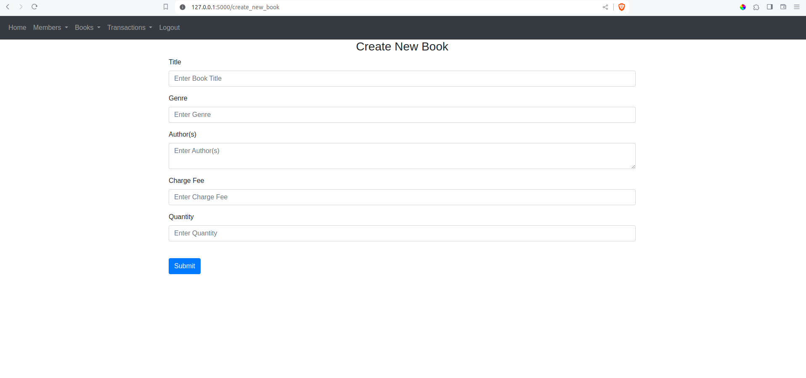

# library_crud

This repository is for test purposes only.The project is under active development.
### Final solution will be under this branch. I will mark this as complete once I am done with the improvements

### Pending Functionality
User Update, Delete

Book Update, Delete

Book Receive Back, Charge and mark book return as complete

Transaction for book fees and fines association with book record


## Instructions for running project locally
### Ensure you have the following in your development environment:
Install python3

``` sudo apt install python3 ```

Install Flask 

``` pip install flask ```

Install Flask-Login 

``` pip install flask-login ```

Install Flask Alchemy

``` pip install flask-sqlalchemy ```

### Clone this repository to your development environment.
Navigate to the root folder, create .env file and run main.py

``` cd library_crud ```

Install dotenv package

``` pip3 install python-dotenv ```

Create .env file(in root directory) and add the following:

``` touch .env ```

``` DB_NAME = "library_solution.db" ```

``` SECRET_KEY = 'ADD SECRET KEY HERE' ```

Run main.py

``` python3 main.py ```

You will get a url which will help you access the platform on a browser

``` http://127.0.0.1:5000 ```

# Web View

## Default login credentials

``` username: admin@quickmail.com    password: 1234567 ```

  

# User Management



# Books CRUD (Update and Delete Pending)



# Book Issue Records


# Transaction Records
